# Task 1: 간단한 함수 및 테스트 코드 제안 받기 (코드완성)

## Use case: 
- GitHub Copilot를 활용하여 간단한 함수와 테스트 코드를 제안받습니다. 이를 통해, GitHub Copilot이 기본적인 기능을 익히고, 어떠한 방식으로 일반적인 코딩 작업을 지원하는지 확인할 수 있습니다.

## 목표:
- 주석을 활용하여, 간단한 함수 (factorial, is_prime)를 코드완성 기능으로 작성합니다. 
- 오른 마우스를 통해 작성한 함수에 대한 테스트 코드를 작성합니다.
- GitHub Copilot Log를 확인하여, 오픈소스와 매치되는 코드인 경우 레퍼런스 정보를 확인합니다. 
- IntelliJ IDEA의 Copilot 메뉴에 관한 기본적인 설정들을 변경해 봅니다.

## Step 1 : 기본 함수 작성
- IntelliJ IDEA를 열고, 새로운 프로젝트를 시작합니다.   
  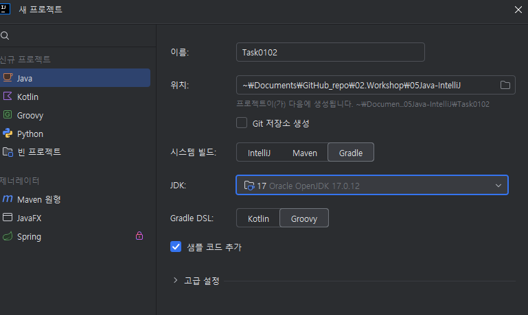
- 아래의 주석을 입력 합니다. 
  `// factorial 메서드 추가 ` 
  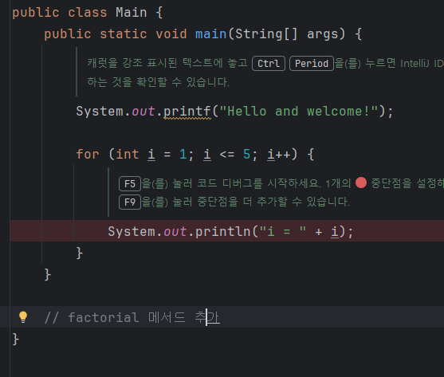

- 회색으로 제안된 코드를 확인하고, Tab키를 눌러서 코드를 완성합니다. 
   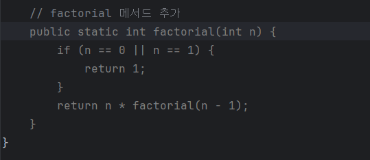

- 두번째로 아래 주석을 입력합니다. 
  `# 소수 판별 함수` 
  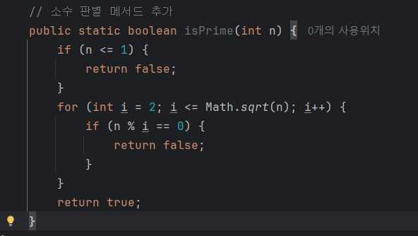

## Step 2 : 오른 마우스 Copilot 메뉴 사용하기
- 마우스 오른 버튼을 클릭하여, 'Copilot' 메뉴의 'generate_test'를 선택합니다. 
  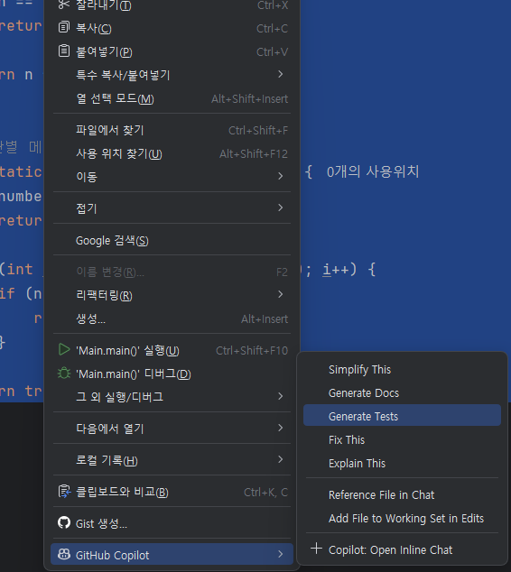
- 'generate_test'를 선택하면, Copilot이 우측 Chat창에서 자동으로 테스트 코드를 생성합니다.   
  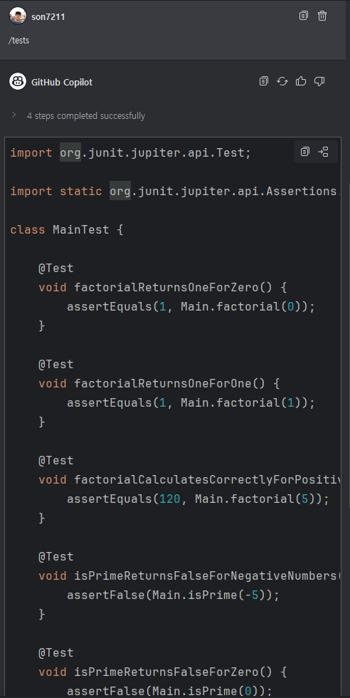

- 마우스 오른 버튼을 클릭하여 'Copilot' 메뉴의 'generate_docs'를 선택합니다. 
    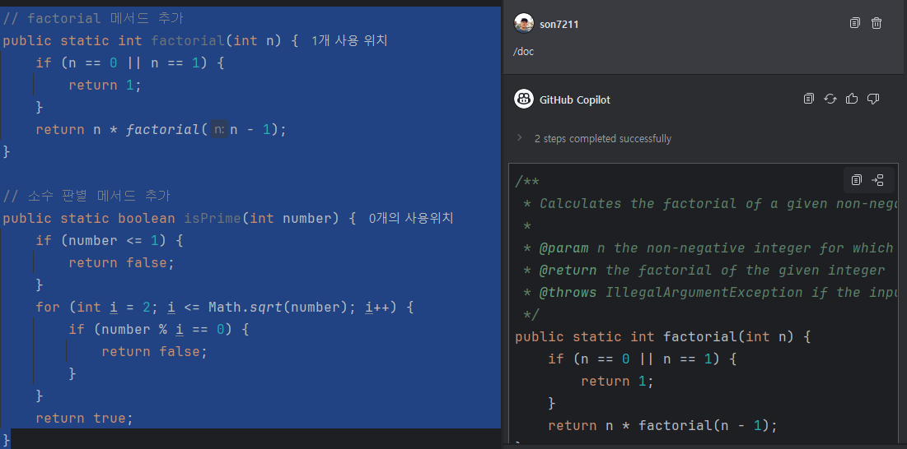 

## Step 3 : 코드 완성 기능의 컨텍스트 이해하기
- Copilot은 코드 완성 기능을 제공하기 위해, **주석과 함수 이름을 기반으로** 컨텍스트를 이해합니다. 
- 또한, 현재 작성중인 파일의 커서 위치의 **전,후 데이터**와, 이 데이터와 유사한 데이터를 **오픈되어져 있는 주변의 탭**에서 찾아 컨텍스트를 이해합니다. (**Neighboring Tab**)  
   - 코드 완성 기능에서의 Neighboring Tab 기법을 테스트하기 위해 아래 절차데로 실습합니다. 
   - `/src` 디렉토리의 `url_tools.java`, `MyUrl.java` 파일 내용을 현재 실습하는 워크스페이스로 복사  

   - 복사된 내용의 파일은 오픈된 상태로 두고, 이 파일을 import한 (예시의 '`MyUrl.java`')  파일의 마지막 라인에서 키보드의 Enter를 누르면 아래와 같이 함수가 제안됩니다.    
    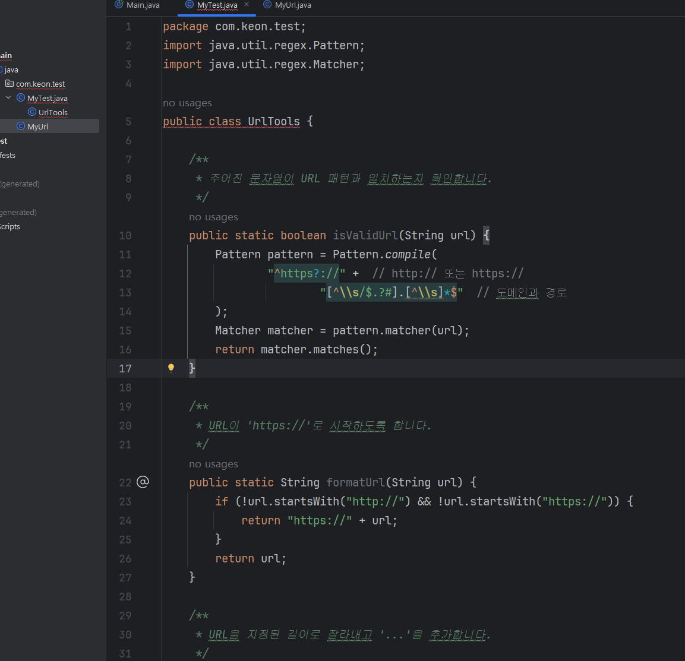
	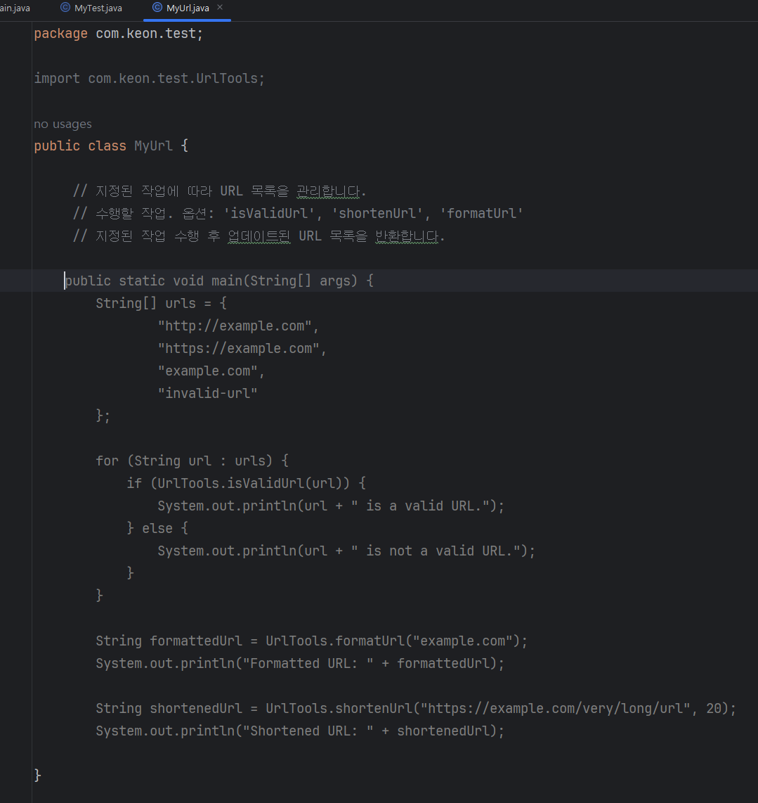

## Step 4 : IntelliJ IDEA의 Copilot 설정 메뉴
- Intelli J IDEA의 우측 하단의 Copilot 아이콘을 클릭하고 `Edit Settings`를 선택합니다. 
  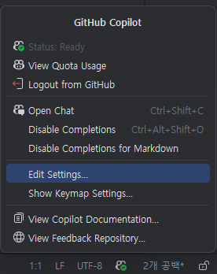
- `Chat`을 선택하고, Natural Language를 '한국어'로 설정합니다.  
  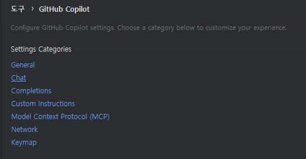
  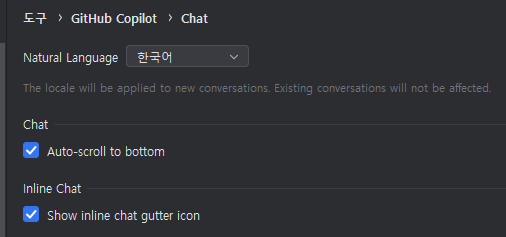

- Code완성 기능의 기본 모델을 변경해 봅니다. 
  - `Completions` 클릭하고, `Model for completions`를 클릭해 봅니다. 
    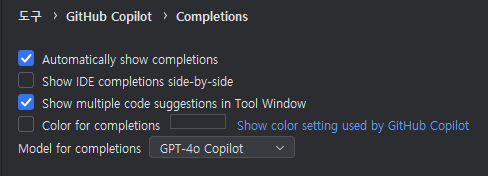

## Step 5: Copilot Log 확인하기
- 상단 메뉴바에 `도구 - GitHub Copilot - Log Diagnostics` 을 클릭합니다.  
  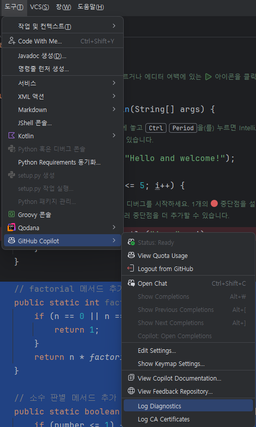
- idea.log 파일이 오픈됩니다.  
  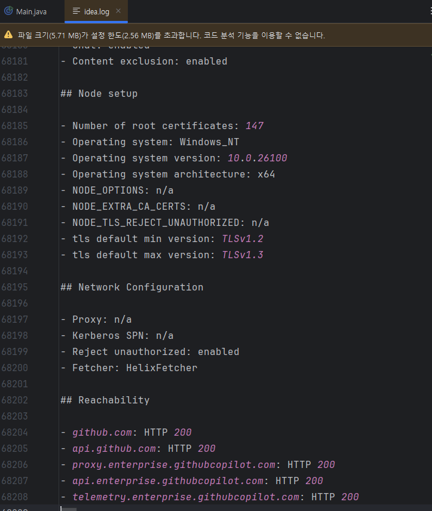

## 참고 : Copilot 관련 기술 지원
- [GitHub 도움말 : Troubleshoot GitHub Copilot 문서 참조](https://docs.github.com/en/enterprise-cloud@latest/copilot/how-tos/troubleshoot)

- (기업 관리자)각종 에러로그, 화면 캡쳐 등을 첨부하여 GitHub 글로벌 Support에 기술지원 요청/문의할 수 있습니다.  
  - [GitHub Support](https://support.github.com)

## 지식 확인
- GitHub Copilot의 코드 완성 기능
- 코드완성 기능의 모델 선택
- GitHub Copilot의 코드 완성 기능의 컨텍스트
- IntelliJ IDEA의 Copilot 설정 메뉴

