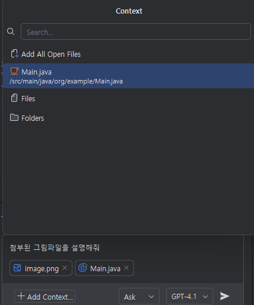

# Task 2: 가위, 바위, 보 게임 만들기 (Copilot Chat사용)

## Use case: 
- GitHub Copilot를 활용하여 가위, 바위, 보 게임을 만들고, 기본 게임에 추가적인 게임 로직을 추가하는 실습을 통해, Copilot의 활용도를 높입니다.

## 목표:
- 가위, 바위, 보 게임을 만듭니다.
- 게임을 실행하고 게임 결과를 출력합니다.
- 기본적인 가위, 바위, 보 게임 외에, Lizard, Spock 등의 확장판 게임을 추가합니다.
- Git 커밋 메세지를 자동으로 생성하는 방법을 알아봅니다.

## Step1 
- Copilot Chat을 이용하여, 가위, 바위, 보 게임을 만들 수 있는 코드를 요청합니다.
- 사용자가 가위,바위,보 중 하나를 선택하고, 컴퓨터와 대결하는 로직을 추가합니다.
- 사용자가 선택한 가위, 바위, 보와 컴퓨터의 선택을 비교하여 승패를 결정하는 로직을 추가합니다.
- 사용자가 게임을 계속할 것인지 종료할 것인지 선택할 수 있는 로직을 추가합니다. 
    
    
    
    

- 게임을 실행하고, 게임 결과를 출력 받아 봅니다. 
    

## Step 2 : Lizard, Spock 추가하기
- 만들어진 게임에 추가로 Lizard, Spock의 로직을 Copilot을 활용하여 추가합니다. 
   
   
- `choices` 리스트에 Lizard와 Spock을 추가합니다. 
   

- 위 image그림 파일을 다운로드하고, resources에 img 디렉토리를 생성하고 그 안에 저장합니다. 
   

- Copilot Chat에 그림 파일을 드래그하여 추가하고, `첨부된 그림 파일을 설명해 줘` 라고 물어봅니다.  
   
   

- Copilot Chat에서 하단에 +Add Context 버튼을 누르고 Main.java 파일을 선택하여 추가합니다. 
   

- 그리고 `Main.java의 가위,바위,보 게임에, 첨부된 그림파일데로 도마뱀과 스팍에 대한 로직 추가해줘` 라고 요청합니다. 
   

- Copilot Chat에서 제안된 코드를 확인합니다. 
   
   

- 제안된 코드를 복사하여 붙여 넣습니다.
   

- 다시 컴파일하고 실행해 봅니다. 
   

## 지식 확인:
- 코드 완성 기능과, Copilot Chat 기능의 차이점
