# Task 3: Spring Boot 기반 Todo App 개발 (Part 1) 

## Use case: 
- Copilot에게 Custom instruction을 제공하여 원하는 형태로 코드 제안을 받습니다.
- Copilot으로 Commit message를 자동 생성해 봅니다. 이 때, 원하는 형태의 Commit message를 생성하기 위해, Custom instruction을 활용합니다.
- (선택사항) GitHub MCP Server를 설정하는 방법을 익힙니다. (이후 Task 4에서 실습)

## 목표:
- Spring Boot 기반 Todo App 프로젝트를 구성하기 위해, 또 원하는 형태로 코드를 제안받기 위해, Copilot에게 Custom instruction의 종류와 가능한 방법들을 익히고, 생성 방법을 익힙니다. 
- Chatmode를 설정하여, Agent 모드에서 기본 제공 모드 외에 'Plan' 모드를 설정하여, Django 프로젝트를 빌드하기 위한 절차를 제안 받습니다.  
- (선택사항) GitHub MCP Server를 설정하는 방법을 실습합니다.


## Step 1: 새로운 프로젝트 시작하기
- IntelliJ IDEA에서 새로운 프로젝트를 생성합니다.
- Gradle을 사용하여 Java 11 기반의 프로젝트를 생성합니다.
 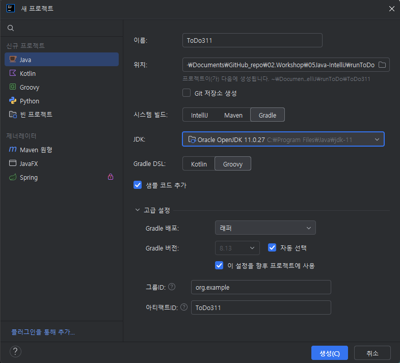 <br>


## Step 2: Custom instructions 란 
 - [Custom instructions 설명](https://docs.github.com/en/enterprise-cloud@latest/copilot/how-tos/custom-instructions/adding-repository-custom-instructions-for-github-copilot?versionId=enterprise-cloud%40latest&tool=jetbrains#about-repository-custom-instructions-for-github-copilot-chat)
 - 팀의 작업 방식, 사용하는 도구, 프로젝트의 세부 사항에 대한 충분한 컨텍스트를 제공하면 GitHub Copilot은 이에 맞춘 챗 응답을 생성할 수 있습니다. 이러한 컨텍스트 정보를 매번 챗 질문에 반복해서 추가하는 대신, 저장소에 파일을 생성하여 자동으로 이 정보를 추가할 수 있습니다. 추가된 정보는 챗에 표시되지는 않지만, Copilot이 더 높은 품질의 응답을 생성하는 데 활용됩니다.

 - **[Custom instructions란: VS Code](https://code.visualstudio.com/docs/copilot/copilot-customization)** 
    - 일반적인 가이드라인이나 규칙을 정의하여 코드 생성, 코드 리뷰 수행, 또는 커밋 메시지 생성과 같은 작업을 수행합니다. Custom instructions는 AI가 작업을 수행해야 하는 조건(작업이 어떻게 수행되어야 하는지)을 설명합니다.

- `.github/copilot-instructions.md` 파일 
  - 코드 생성 지침을 Markdown 형식으로 작성합니다.<br> 
  - 모든 지침은 하나의 파일로 결합되어 워크스페이스에 저장됩니다.<br> 
  - 지침은 모든 챗 요청에 자동으로 포함됩니다.<br> 
  - Copilot을 지원하는 모든 에디터와 IDE에서 지원됩니다.<br>
  - 이 파일을 사용하여 모든 코드 생성 작업에 적용되는 일반적인 코딩 관행, 선호 기술, 프로젝트 요구 사항을 정의합니다. <br>
  - [copilot-instructions예](https://docs.github.com/en/enterprise-cloud@latest/copilot/how-tos/custom-instructions/adding-repository-custom-instructions-for-github-copilot?tool=vscode#repository-custom-instructions-example) <br>

## Step 3: Custom instructions 작성법 및 권고 
- 프로젝트의 목적, 기능에 대한 상위 수준의 정의
- 기술 스택, 사용되는 (선호하는) 라이브러리와 프레임 워크 and frameworks
- 프로젝트 구조 및 파일 구성
- 코드 스타일 및 컨벤션
- 주석 및 문서화 스타일
- 디자인 패턴 및 아키텍처 원칙
- 테스트 전략 및 프레임워크 
- 보안 및 성능 고려 사항

### 3-1. Custom instructions 생성에 대한 팁
- [설명링크](https://code.visualstudio.com/docs/copilot/copilot-customization#_tips-for-defining-custom-instructions)

- 지침은 간결하고 독립적으로 작성하세요. 각 지침은 하나의 간단한 문장이어야 합니다. 여러 정보를 제공해야 하는 경우, 여러 개의 지침으로 나누어 작성하세요.

- 지침에서 특정 코딩 표준과 같은 외부 리소스를 참조하지 마세요.

-(VS Code의 경우) 지침을 여러 파일로 분리하세요. 이 방법은 주제나 작업 유형별로 지침을 정리하는 데 유용합니다.

- 지침 파일에 지침을 저장하여 팀이나 프로젝트 간에 쉽게 공유할 수 있도록 하세요. 또한 파일을 버전 관리하여 시간 경과에 따른 변경 사항을 추적할 수 있습니다.

- 프롬프트 파일에서 사용자 정의 지침을 참조하여 프롬프트를 깔끔하고 집중되게 유지하고, 다른 작업에 대해 지침을 중복 작성하지 않도록 하세요.


## 참고 : VS Code에서의 instructions.md 파일 
###  `.instructions.md` 파일 
  - 특정 작업에 대한 사용자 정의 지침을 저장하기 위해 하나 이상의 `.instructions.md` 파일을 생성할 수 있습니다. 예를 들어, 다양한 프로그래밍 언어, 프레임워크 또는 프로젝트 유형에 대한 지침 파일을 생성할 수 있습니다. VS Code는 모든 채팅 요청에 지침 파일을 자동으로 추가하거나, 특정 파일에 대해 지침이 자동으로 적용되도록 지정할 수 있습니다. 또는 채팅 프롬프트에 지침 파일을 수동으로 첨부할 수도 있습니다. <br>
  - Workspace 또는 User 프로필에 하나 이상의 지침 파일을 생성하여 사용할 수 있습니다. <br>
	- 워크스페이스 지침 파일: 워크스페이스 내에서만 사용할 수 있으며, 워크스페이스의 .github/instructions 폴더에 저장됩니다. <br>
  - glob 패턴을 사용하여 모든 요청 또는 특정 파일에 대한 지침을 자동으로 포함합니다.<br>
  - 작업별 코드 생성 지침을 정의하고, 챗 프롬프트와 함께 지침을 포함할 시점을 더 잘 제어하려면 이 파일을 사용합니다. <br>
  - [instructions 파일 예시](https://code.visualstudio.com/docs/copilot/copilot-customization#_custom-instructions-examples) <br>	  

### `settings.json` 파일에 설정
- "text", 혹은 "file"을 지정할 수 있습니다. 

| Instruction 유형                | 설정 이름                                           |
|---------------------------------|----------------------------------------------------|
| 코드 리뷰                       | `github.copilot.chat.reviewSelection.instructions` |
| 커밋 메시지 생성                | `github.copilot.chat.commitMessageGeneration.instructions` |
| 풀 리퀘스트 제목 및 설명 생성   | `github.copilot.chat.pullRequestDescriptionGeneration.instructions` |
| 코드 생성 (Deprecated)          | `github.copilot.chat.codeGeneration.instructions` |
| 테스트 생성 (Deprecated)        | `github.copilot.chat.testGeneration.instructions` |

- [설정예시](https://code.visualstudio.com/docs/copilot/copilot-customization#_specify-custom-instructions-in-settings) <br>

	
## Step 4: Custom instructions 파일 생성, 수정하기 
- Custom instructions를 생성하기 위해, 우측 하단의 GitHub Copilot 아이콘을 클릭하고 `Edit Settings`를 선택합니다. <br>
  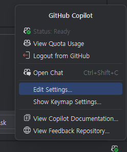 <br>

- Custom instructions를 선택합니다. <br> 
  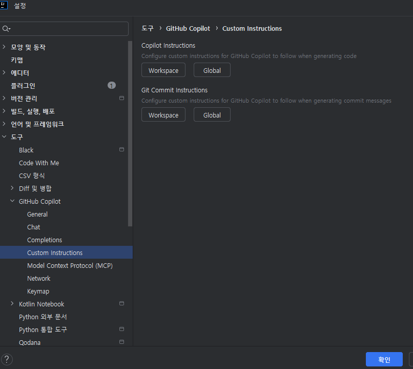 <br>

- Copilot instructions 의 Workspace를 선택하고, 빈 파일이 생성되면, 예제로 제공된 현재 디렉토리의 `.github/instructions` 디렉토리의 파일을 복사하여 활용합니다. <br>
  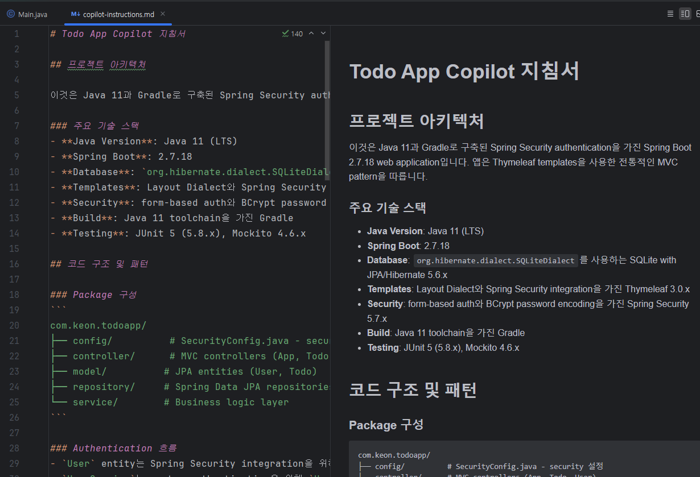 <br>
 

### 4-1. 기존 프로젝트에서 custom instructions 생성하기
- 이 기능은 VS Code에서 가능합니다.
- 기존 프로젝트를 VS Code로 오픈합니다.
- VS Code의 GitHub Copilot 플러그인 설치, 계정 로그인 후, Copilot Chat을 엽니다.
- Copilot Chat창의 우측 상단에 톱니 바퀴 아이콘을 클릭하고, `Generate Instructions`를 선택합니다. <br>
	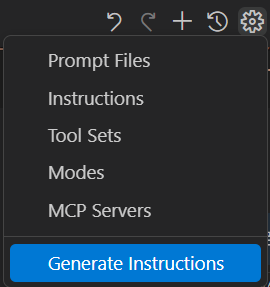 <br>

## Step 5: Git Commit instructions 설정하기
- Copilot Edit Settings에서 `Git Commit instructions`의 'Workspaces' 선택합니다. <br>
- git-commit-instructions.md 파일이 생성되면, 아래와 같이 내용을 작성합니다. <br>
```markdown
- 커밋 메시지는 한글로 작성하며, 현재 시제로 작성합니다.
- 커밋 메시지는 변경 내용을 자세히 요약해서, 
- 항목마다 문장 앞에 '-'를 붙여서 작성합니다. 
- 이모지들을 포함합니다.
- 커밋 메시지는 아래와 같은 키워드가 포함되 작성합니다.
	- feat: 새로운 기능 추가
	- fix: 버그 수정
	- docs: 문서 수정
	- style: 코드 스타일 변경 (포맷팅, 세미콜론 누락 등)
	- refactor: 코드 리팩토링
	- perf: 성능 개선
	- test: 테스트 코드 추가
	- chore: 빌드 업무 수정, 패키지 매니저 설정 등
```
  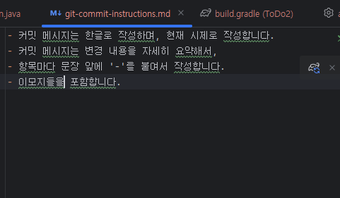 <br>

## Step 6: Chat Mode  
- Copilot Chat의 기본 3가지 모드를 확인해 봅니다. <br>

| 챗 모드 | 설명  |
|---------------|------------------------------------------------------------------------------------------|
| Ask 모드     | Ask 모드는 코드베이스, 코딩, 일반 기술 개념에 대한 질문에 답변하는 데 최적화되어 있습니다. <br> 질문 모드를 사용하여 코드가 어떻게 작동하는지 이해하거나, 소프트웨어 디자인 아이디어를 브레인스토밍하거나, 새로운 기술을 탐구할 수 있습니다. <br> |
| Edit 모드     | Edit 모드는 프로젝트의 여러 파일에서 코드 편집을 수행하는 데 최적화되어 있습니다. <br> VS Code는 코드 변경 사항을 편집기에 직접 적용하며, 그곳에서 변경 사항을 검토할 수 있습니다. <br> 편집 모드는 변경하려는 내용을 잘 이해하고, 어떤 파일을 편집할지 알고 있을 때 코딩 작업에 사용합니다. <br> |
| Agent 모드 | Agent 모드는 프로젝트의 여러 파일에서 자동으로 편집을 수행하는 데 최적화되어 있습니다. <br> 에이전트 모드는 명확히 정의되지 않은 작업을 수행해야 하며, 터미널 명령 및 도구 실행이 필요할 수 있는 경우 코딩 작업에 사용합니다. <br> |


#### 참고: VS Code에서의 커스텀 챗 모드
- 커스텀 챗 모드는 `.chatmode.md`라는 Markdown 파일로 정의되며, 워크스페이스에 저장하여 다른 사람들이 사용할 수 있도록 하거나 사용자 프로필에 저장하여 다양한 워크스페이스에서 재사용할 수 있습니다.
- 커스텀 챗 모드는 특정 모드로 전환할 때 적용되는 지침과 도구 세트로 구성됩니다. 예를 들어, "Plan" 챗 모드는 구현 계획을 생성하기 위한 지침을 포함하고 읽기 전용 도구만 사용할 수 있습니다. 커스텀 챗 모드를 생성하면 관련 도구와 지침을 매번 수동으로 선택하지 않고도 해당 구성으로 빠르게 전환할 수 있습니다.
- [VS code 설명링크](https://code.visualstudio.com/docs/copilot/chat/chat-modes)

- [Chat mode 파일 예시](https://code.visualstudio.com/docs/copilot/chat/chat-modes#_chat-mode-file-example) <br>


## Step 6: Git 활성화 하기
- `.gitignore` 파일을 생성합니다. <br>
  - Copilot Chat에서 `Agent` 모드를 선택하고, 아래와 같이 요청합니다. <br>
  - `자, 이제 이 프로젝트의 gitignore 파일을 생성해 줘.` <br>
  - 생성된 .gitignore 파일을 확인합니다. <br>

- IntelliJ IDEA에서 Git을 활성화합니다.
 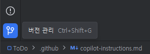 <br>
  <br>

### (선택사항) GitHub 저장소와 연동하기
- 이 Step의 실습은 선택 사항입니다. (GitHub.com 활용이 가능한 경우.)

- 상단 메뉴바의 'VCS' 메뉴에서 `GitHub > GitHub에 프로젝트 공유` 메뉴를 통해 리모트 저장소를 설정합니다. <br>
 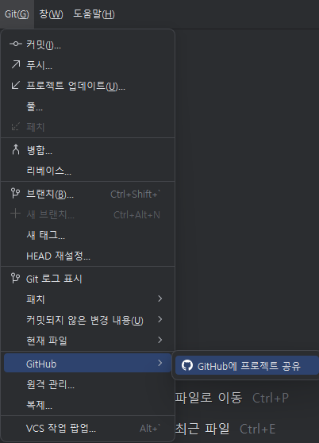 <br>
 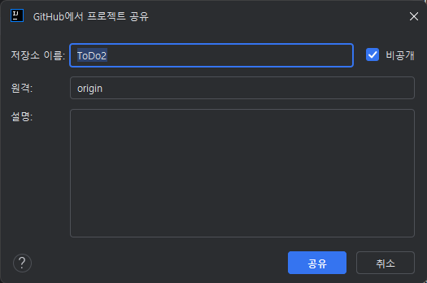 <br>

- 혹은, 개인 저장소 대신 다른 Organization의 저장소를 사용하고 싶다면, 상단 메뉴바의 'git' 메뉴에서 `원격관리` 메뉴를 통해 설정합니다. <br>
 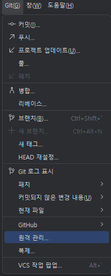 <br>
 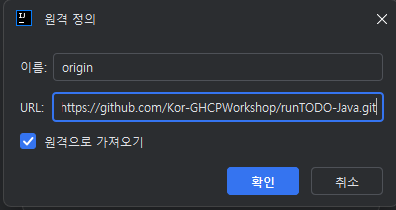 <br>

## Step 7. Copilot으로 Commit message 자동 생성 (위 Custom instruction으로 원하는 형태로 제안받기)
- 왼편 '커밋' 메뉴를 선택하고, 변경 파일들을 선태한 뒤, 가운데 GitHub Copilot 아이콘을 클릭하여, 커밋 메세지를 제안받습니다. <br>
  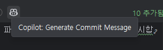 <br>
- Copilot이 제안한 커밋 메시지를 확인하고, 원하는 경우 수정합니다. <br>
  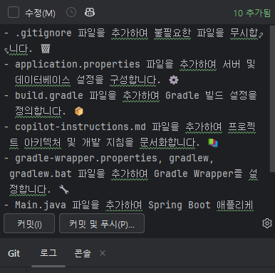 <br>


## (선택사항) Step 8: GitHub MCP Server 설정하기
- MCP Server에 대한 설명은 [Task 8](../Task08/README.md)에서 자세히 다룹니다.
- 현재 Task에서는 GitHub MCP Server를 설정하여, 다음 Task04에서 실제 TODO 앱 프로젝트를 구성할 때, Copilot Chat에서 GitHub MCP Server를 이용해, GitHub 저장소에 Issue를 등록할 수 있도록 합니다. <br>
- GitHub MCP Server(https://github.com/github/github-mcp-server) 는 GitHub에서 제공하는 공식 MCP 서버로, GitHub.com의 각종 다양한 기능을 제공합니다. <br>

- 개발 랩탑 로컬에 Docker를 설치하고, Docker를 이용해 랩탑에서 GitHub MCP Server를 실행할 수 있습니다. 
- 위 github-mcp-server 저장소의 설정 파일의 내용을 복사합니다. <br> 
  - [설정 파일 링크](https://github.com/github/github-mcp-server/blob/main/docs/installation-guides/install-other-copilot-ides.md#local-server-1)

- IDEA 우측 하단의 GitHub Copilot 아이콘을 클릭하고, `Edit Settings`를 선택하고, 이어지는 화면에서 Model Context Protocol을 선택하여 설정합니다. <br>
  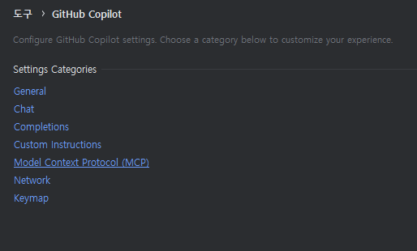 <br>
  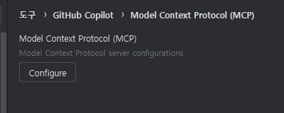 <br>

- 위에서 복사한 설정 파일의 내용을 붙여 넣고 저장합니다. <br>
  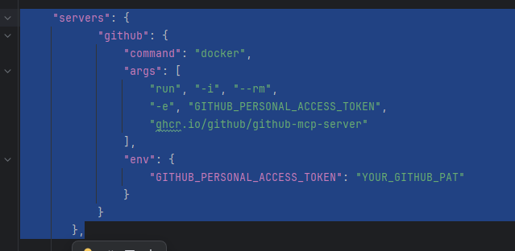 <br>

- GitHub Personal Access Token을 추가합니다. <br>
  - GitHub.com에서 Personal Access Token을 생성하고, 해당 토큰을 MCP Server 설정에 추가합니다. <br>
  - [GitHub Personal Access Token 생성 방법](https://docs.github.com/en/enterprise-cloud@latest/authentication/keeping-your-account-and-data-secure/creating-a-personal-access-token) 참조

- 추가된 GitHub MCP Server를 확인하기 위해, Agent 모드로 이동하여, 도구 모양 아이콘을 클릭하여 도구 목록에서 'GitHub' 확인합니다. <br>
  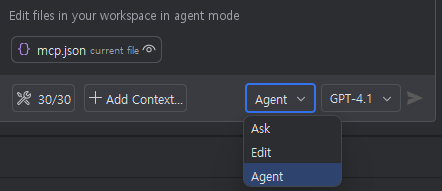 <br>
  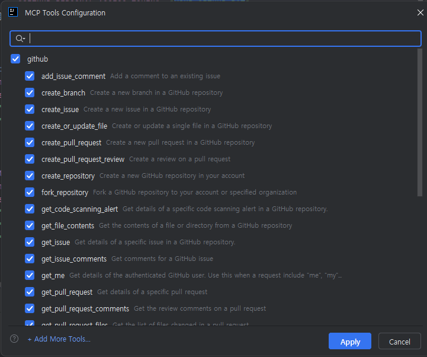 <br>

- 온프렘 설치형 GitHub Enterprise Server를 사용하는 경우, 아래링크의 설명 방법으로 MCP 서버를 설정할 수 있습니다. <br>
  - [GitHub Enterprise Server에서 MCP 서버 설정](https://github.com/github/github-mcp-server#github-enterprise-server-and-enterprise-cloud-with-data-residency-ghecom) <br>

## Step 9: 저장
- 상단 메뉴바의 '`파일 - 모두저장`'을 선택하여, 현재까지의 내용을 저장합니다. <br>

## 지식 확인
- 이번 Task에서는 TODO 앱 프로젝트를 시작하기 위해, 
  - Copilot의 Custom instructions를 생성하고, 
  - (선택사항) Remote GitHub 저장소와, GitHub MCP server를 설정하여 TODO앱을 만들기 위한 준비를 마쳤습니다. 
