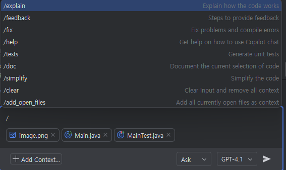
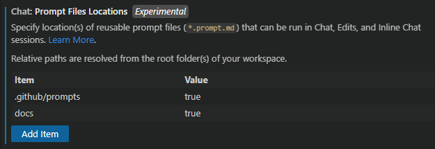
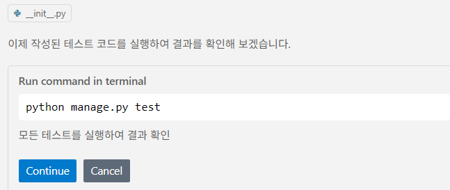
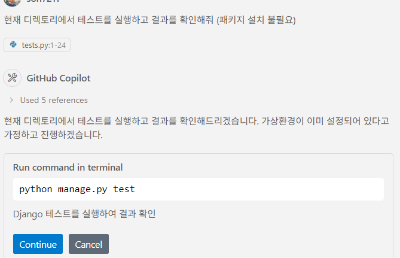
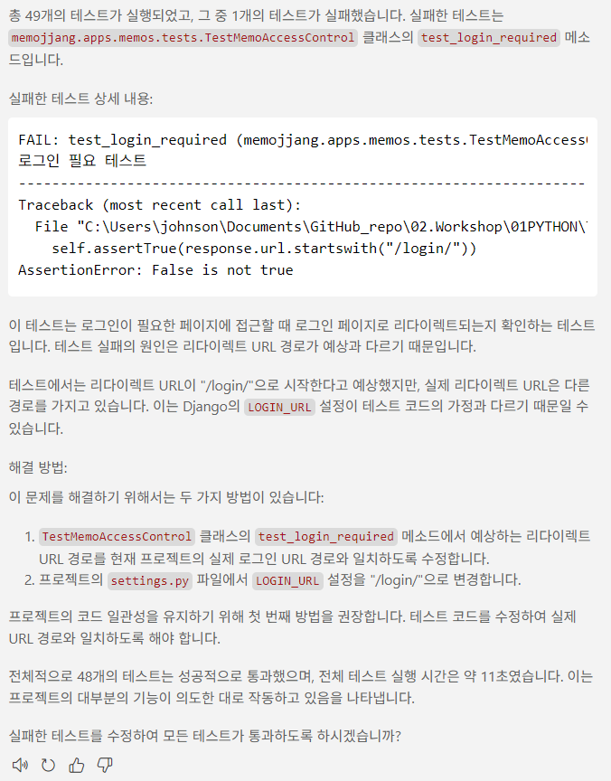

# Task 5: 프롬프트와 컨텍스트 사용

## Use case: 
- 효율적인 프롬프트 작성과 컨텍스트 활용 방법을 익힙니다. 
- Copilot Chat에 추가할 수 있는 다양한 컨텍스트들에 대해 확인합니다. 

## 목표:
- 효율적인 프롬프트 작성과 컨텍스트 활용을 통해 Copilot을 활용하는 방법을 익힙니다.
- Copilot Chat에 추가할 수 있는 다양한 컨텍스트들에 대해 확인합니다. 

## Step 1: 효율적인 Copilot 사용을 위한 팁 
- Copilot에게 프롬프트(Chat의 질문, 코드의 주석 등)를 작성할 때는, 
  - 명확하고 구체적으로 모호하지 않게 전달합니다.  
  - 필요한 컨텍스트를 충분히 제공합니다. 
  - 원하는 결과를 명확하게 설명합니다. 
  - Copilot이 이해할 수 있는 언어로 작성합니다.

- Copilot에게 컨텍스트 제공  
  - Copilot은 여러분이 무엇을 하고 있는지, 어떤 도움을 원하는지 충분한 컨텍스트가 있을 때 가장 잘 작동합니다. 특정 프로그래밍 작업에 대해 동료에게 도움을 요청할 때 컨텍스트를 제공하는 것처럼, Copilot에게도 동일하게 컨텍스트를 제공할 수 있습니다.

- 파일 열기  
  - 코드 자동완성을 위해 Copilot은 현재 편집 중인 파일과 에디터에 열린 파일들을 분석하여 컨텍스트를 파악하고 적절한 제안을 생성합니다. VS Code에서 관련 파일들을 열어두면 Copilot이 프로젝트의 더 넓은 맥락을 이해하는 데 도움이 됩니다.

- 최상위 주석  
  - 동료에게 간단하고 높은 수준의 소개를 제공하는 것처럼, 작업 중인 파일에 최상위 주석을 추가하면 Copilot이 여러분이 만드는 코드의 전체적인 맥락을 이해하는 데 도움이 됩니다.

- 적절한 include 및 참조  
  - 작업에 필요한 include나 모듈 참조는 직접 설정하는 것이 가장 좋습니다. Copilot이 제안을 할 수 있지만, 어떤 의존성이 필요한지 여러분이 더 잘 알고 있을 것입니다. 또한 Copilot에게 어떤 프레임워크, 라이브러리, 버전을 사용하고 싶은지 알려주는 데 도움이 됩니다.

- 의미 있는 함수/변수 이름  
  - fetchData()와 같은 메서드는 동료에게 큰 의미가 없듯이, Copilot에게도 도움이 되지 않습니다. 의도를 명확하기 보여주기 위한 의미 있는 이름을 사용하면 Copilot이 원하는 동작을 하는 본문을 제안하는 데 도움이 됩니다.

- 구체적이고 범위가 명확한 함수 주석  
  - 함수 이름만으로는 지나치게 길어지지 않는 한 충분히 설명할 수 없습니다. 함수 주석은 Copilot이 알아야 할 세부 정보를 채워주는 데 도움이 됩니다.

- 샘플 코드로 Copilot에 힌트 주기  
  - Copilot이 올바른 방향으로 제안하도록 하려면, 원하는 결과와 유사한 샘플 코드를 에디터에 복사해 붙여넣는 것이 한 가지 방법입니다. 작은 예시를 제공하면 Copilot이 원하는 언어와 작업에 맞는 제안을 생성하는 데 도움이 됩니다. Copilot이 실제로 사용할 수 있는 코드를 제공하기 시작하면, 샘플 코드는 파일에서 삭제해도 됩니다. 특히 Copilot이 이전 버전의 코드를 제안할 때, 최신 라이브러리 버전으로 점프 스타트하는 데 유용합니다.

- Copilot은 확률에 기반(probabilistic)하여 작동합니다. 
  - Copilot은 확률에 기반하여 작동하므로, Copilot이 제안하는 코드가 항상 정확하거나 최적의 솔루션이 아닐 수 있습니다. Copilot이 생성한 코드를 검토하고, 필요에 따라 수정하는 것이 중요합니다. Copilot은 여러분의 코딩 스타일과 선호도를 학습할 수 있지만, 항상 완벽하지는 않습니다.

## Step 2: Copilot Chat의 Chat participants
- [Chat participant](https://code.visualstudio.com/api/extension-guides/ai/chat)(채팅 참가자)는 사용자가 Copilot Chat에서 도메인별 전문가와 함께 채팅을 확장할 수 있도록 해주는 특화된 어시스턴트입니다. 사용자는 `@멘션`을 통해 채팅 참가자를 호출하며, 해당 참가자가 사용자의 자연어 프롬프트를 처리하는 역할을 담당합니다.

- IntelliJ IDEA에는 `@project`, `@github`, `@models`와 같은 여러 내장된 채팅 참가자가 있습니다. 이들은 각자의 도메인에 대한 질문에 최적화되어 있습니다.

### 참고 @project
- `@projct`는 ([설명링크](https://github.blog/changelog/2025-02-19-boost-your-productivity-with-github-copilot-in-jetbrains-ides-introducing-project-context-ai-generated-commit-messages-and-other-updates/#project-context)) VS Code의`@workspace`에 해당하며, 이것 Ask 모드에서 사용자가 질문한 내용에 대해 전체 코드베이스에서 관련된 파일들과 심볼들을 검색하고, 이것들을 답변에 참조합니다.  
  - [VS Code @workspace 설명문서](https://code.visualstudio.com/docs/copilot/reference/workspace-context)

  - `@projct` 는 
    - 먼저, 사용자 질문에 답변하는 데 필요한 정보를 파악합니다. 여기에는 대화 기록, 작업 공간 구조, 현재 선택된 코드 등이 포함됩니다.

    - 다음으로, 다양한 방법으로 컨텍스트를 수집합니다. 로컬 검색이나 GitHub 코드 검색을 통해 관련 코드 조각을 찾고, 
    - 마지막으로, 이 컨텍스트는 GitHub Copilot이 질문에 답변하는 데 사용됩니다. 컨텍스트가 너무 크면 가장 관련성 높은 부분만 사용됩니다. 응답에는 파일, 파일 범위, 심볼에 대한 참조가 표시됩니다. 이를 통해 채팅 응답에서 코드베이스의 해당 정보로 직접 연결할 수 있습니다. Copilot에 제공된 코드 조각은 응답의 참조로 나열됩니다.
	
  - `@project`를 활용하면, 
    - 코드 검색
	- 복잡한 코드 편집에 대한 플래닝
	- 코드 베이스의 구조나 기능 구현된 것에 대한 상위 수준의 질문

## Step 4: Copilot Chat에서 슬래시 명령(/) 사용하기
- 슬래시 명령어(/)는 Copilot Chat에게 간단하게 필요한 내용을 전달할 수 있습니다. 예를 들어, 코드베이스를 학습하려는 경우(/explain), 문제 해결을 원할 때(/fix), 테스트 케이스를 만들고 싶을 때(/tests) 사용할 수 있습니다. Copilot Chat에게 여러분이 무엇을 하려는지 알려주면, 해당 작업에 맞게 답변을 조정하고 유용한 명령어, 설정, 코드 스니펫을 제공합니다.
  
    
  

#### 참고: VS Code Chat Variables (#changes, #githubRepo, #githubIssue 등)
- Copilot Chat은 다양한 변수를 지원합니다. 이 변수들은 `#`으로 시작하며, 특정 작업이나 컨텍스트에 대한 정보를 제공합니다. 예를 들어, `#changes`는 현재 변경된 파일을 나타내고, `#githubRepo`는 GitHub 저장소에 대한 정보를 나타냅니다.
- Chat variables는 Copilot Chat이 여러분의 질문에 더 정확하게 답변할 수 있도록 도와줍니다. 예를 들어, `#githubRepo` 변수를 사용하면 Copilot Chat이 현재 작업 중인 GitHub 저장소에 대한 정보를 자동으로 가져올 수 있습니다.
- Chat variables는 Copilot Chat의 프롬프트 입력 필드에서 사용할 수 있으며, 슬래시 명령어(/)와 함께 사용하여 더 나은 결과를 얻을 수 있습니다. 예를 들어, `/tests #changes`를 입력하면 현재 변경된 파일에 대한 테스트 케이스를 생성할 수 있습니다.
- Chat variables는 채팅창에 입력하는 프롬프트 문장 중간에 사용할 수 있습니다. 

- 예시: 코드 changes 
  - `#changes 내용을 요약해줘`
  - `#changes를 기반으로 릴리즈 노트를 작성해줘`

- 예시 : 코드베이스에 대해 질문하기
  - `#codebase에서 인증(authentication)이 어떻게 동작하는지 설명해줘`
  - `#codebase에서 데이터베이스 연결 문자열이 어디에 설정되어 있는지 알려줘`
  - `#codebase를 어떻게 빌드하는지 알려줘`
  - `#getUser가 어디에서 사용되는지 #usages로 알려줘`

- 예시: 현재 코드베이스에 일관된 코드 생성하기
  - `소개 페이지를 만들고 네비게이션 바에 포함해줘 #codebase`
  - `주소 정보를 업데이트하는 새로운 API 경로를 추가해줘 #codebase`
  - `로그인 버튼을 추가하고 #styles.css를 참고해서 스타일을 적용해줘`

- 예시: 워크스페이스에 문제점 해결하기
  - `#problems에 있는 문제들을 해결해줘`
  - `#testFailure에서 실패하는 테스트들을 해결해줘`

- 예시: Extension에 대한 정보 얻기
  - `이 워크스페이스에서 가장 많이 사용되는 #extensions은 무엇인가요?`

- 예시: 웹사이트 참조하여 질문하기 
  - `react 18에서 'useState' 훅을 어떻게 사용하는지 알려줘 #fetch https://18.react.dev/reference/react/useState#usage`
  - `주소 정보를 가져오는 API 엔드포인트를 만들어줘. #githubRepo contoso/api-templates의 템플릿을 사용해줘`

- 예시: 실행된 터미널 명령어 결과에 대한 질문하기
  - `#terminalSelection의 내용 설명해줘`
  - `@workspace /fix #terminalLastCommand`

- [전체 Chat Variable 목록](https://code.visualstudio.com/docs/copilot/reference/copilot-vscode-features#_chat-variables) 

#### 참고: VS Code의 프롬프트 파일 - 재활용 가능한 프롬프트 지시 

- **[Prompt 파일 이란?](https://code.visualstudio.com/docs/copilot/copilot-customization#_prompt-files-experimental)**
  - 프롬프트 파일은 `.prompt.md` 확장자를 가진 Markdown 파일로 정의되며, 코드 생성이나 코드 리뷰 수행과 같은 일반적인 작업을 위한 재사용 가능한 프롬프트입니다. 프롬프트 파일은 독립적인 프롬프트로, 채팅에서 직접 실행할 수 있습니다. 선택적으로 작업 수행 방법에 대한 지침을 포함할 수도 있습니다.

  - 프롬프트 파일은 instruction 파일을 활용하여 일반적인 가이드를 재사용하고 작업별 지침을 프롬프트에 포함할 수 있습니다. 예를 들어, 보안 리뷰 프롬프트 파일은 일반적인 보안 관행을 설명하는 사용자 정의 지침을 참조하면서, 리뷰 결과를 보고하는 방법에 대한 특정 지침을 포함할 수 있습니다.

### 프롬프트 파일 위치
  - 프롬프트 파일은 `.github/prompts` 디렉토리 또는 사용자 지정에 의한 다른 디렉토리에 저장할 수 있습니다.
  

##### 프롬프트 파일 예시
  - [예시 링크](https://code.visualstudio.com/docs/copilot/copilot-customization#_prompt-file-examples)

##### 프롬프트 파일 실행

- security-check 프롬프트 파일을 열고, 우측 상단에 'Play' 버튼을 클릭하여 실행합니다.  
    
    
    
    

## 추가자료
- [Prompt engineering for Copilot Chat](https://code.visualstudio.com/docs/copilot/chat/prompt-crafting)
- [Best practices for using GitHub Copilot in VS Code](https://code.visualstudio.com/docs/copilot/prompt-crafting)
- [IDE에서 GitHub Copilot 사용 팁, 트릭과 모범 사례](https://github.blog/developer-skills/github/how-to-use-github-copilot-in-your-ide-tips-tricks-and-best-practices/)
- [프롬프트엔지니어링과 LMM에 대한 개발자 가이드](https://github.blog/ai-and-ml/generative-ai/prompt-engineering-guide-generative-ai-llms/)
- [Introduction to prompt engineering with GitHub Copilot](https://learn.microsoft.com/training/modules/introduction-prompt-engineering-with-github-copilot//?WT.mc_id=academic-113596-abartolo)
- [GitHub Copilot에게 더 좋은 프롬프트를 작성하기 위한 예제와 모범사례](https://github.blog/developer-skills/github/how-to-write-better-prompts-for-github-copilot/)

- [GitHub Copilot을 활용한 Unit test생성 사용예](https://github.blog/ai-and-ml/github-copilot/how-to-generate-unit-tests-with-github-copilot-tips-and-examples/)
