# Task 6: Copilot을 통해 Java version 업그레이드, 코드 리팩토링, 보안 문제 확인

### Use case: 
- GitHub Copilot을 활용하여 Java version 업그레이드를 진행합니다. 
- GitHub Copilot을 활용해 코드 리팩토링과 보안 문제를 확인합니다.

### 목표:
- 이전 Task에서 생성한 TODO 앱 프로젝트에 대해, VS Code의 GitHub Copilot Java version upgrade 도구를 활용해, Java version을 11에서 17로 업그레이드 합니다. 
- Copilot Chat을 활용해 코드를 리팩토링 하는 예제를 실습합니다.
- GitHub Copilot Chat을 활용해 문제점을 찾고, 해결 방법을 제안 받습니다.

## Step 1: GitHub Copilot을 이용한 Java version 업그레이드

### 1-1. 환경 설정
- VS Code에서 GitHub Copilot Java version upgrade 도구를 사용하여, Java version을 11에서 17로 업그레이드 합니다.
- 이 실습을 위해서는, VS Code를 설치해야 합니다. 아래 링크를 참고하여 VS Code를 설치합니다.
  - [VS Code 설치하기](https://code.visualstudio.com/docs/setup/setup-overview)

- VS Code에서 GitHub Copilot을 셋업 합니다.
  - [GitHub Copilot 셋업하기](https://code.visualstudio.com/docs/copilot/setup#_set-up-copilot-in-vs-code)

- 타겟 버전: Java SDK 17 설치
- [VS Code의 GitHub Copilot app modernization 확장 팩 설치](https://marketplace.visualstudio.com/items?itemName=vscjava.vscode-app-mod-pack). 

  - 이 확장 팩은 다음 두 확장을 번들로 묶습니다.
     - Java용 GitHub Copilot 앱 현대화(미리 보기)
     - GitHub Copilot 앱 현대화 - Java용 업그레이드(미리 보기)

### 1-2. [Java version 업그레이드 사용사례](https://learn.microsoft.com/ko-kr/java/upgrade/overview#common-use-cases)
- Java 런타임 버전을 업그레이드합니다. Java 8 또는 11에서 Java 17 또는 21과 같은 최신 버전으로 애플리케이션을 원활하게 업그레이드합니다.
- 최신 프레임워크 버전으로 업그레이드합니다. 호환성이 손상되는 변경 내용을 지능적으로 처리하여 Spring Boot 2.7에서 3.2와 같은 버전으로 전환합니다.
- CVE 취약성을 검색합니다. 업그레이드 프로세스 중에 타사 종속성에서 알려진 보안 취약성을 감지하고 해결합니다.
- 코드 동작 일관성을 보장합니다. 동작 불일치를 감지하고 해결하여 애플리케이션이 업그레이드 후 동일한 동작을 수행하고 있는지 확인합니다.
- 테스트 범위가 낮은 프로젝트에 대한 단위 테스트 사례를 생성합니다. 단위 테스트 생성 도구는 업그레이드 프로세스와 독립적으로 단위 테스트 사례를 만들 수 있습니다.

### 1-3. Java version 업그레이드 실습
- VS Code에서 Task03, Task04에서 생성한 Spring Boot 기반 Todo App 프로젝트를 엽니다.
- VS Code의 왼쪽 사이드바에서 확장 아이콘을 클릭하고, "`GitHub Copilot app modernization`" 확장을 검색하여 설치합니다. 
   

- Version upgrade를 위해, Copilot Agent모드로 전환 합니다.  
- Agent 모드에서 도구 모양 아이콘을 클릭하면, `GitHub Copilot app modernization` 도구가 표시됩니다.  
  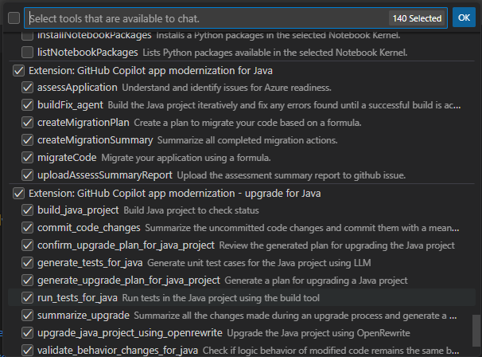 

- Copilot Chat에서 아래와 같이 프롬프트를 입력합니다.  
  - `Java version을 17로 업그레이드 해주고, Spring Boot 3.4.2로 업그레이드 해줘`
  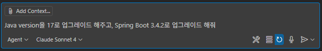 

- GitHub Copilot app modernization 도구가 계정 인증을 진행합니다.  

   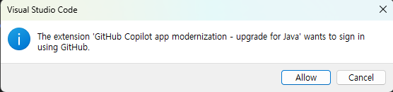 
   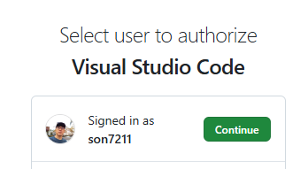 
   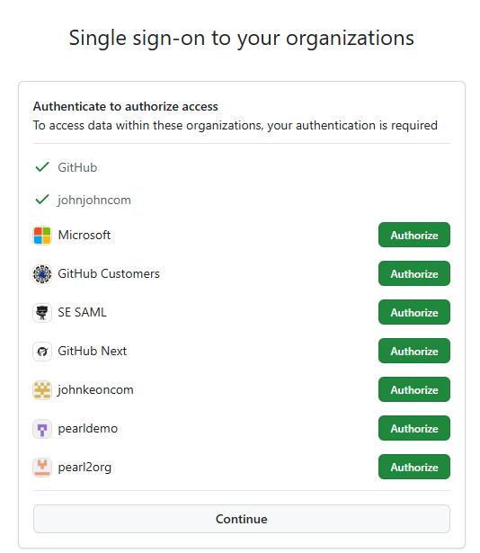 

- 인증 완료 후, Upgrade plan이 진행됩니다.  
  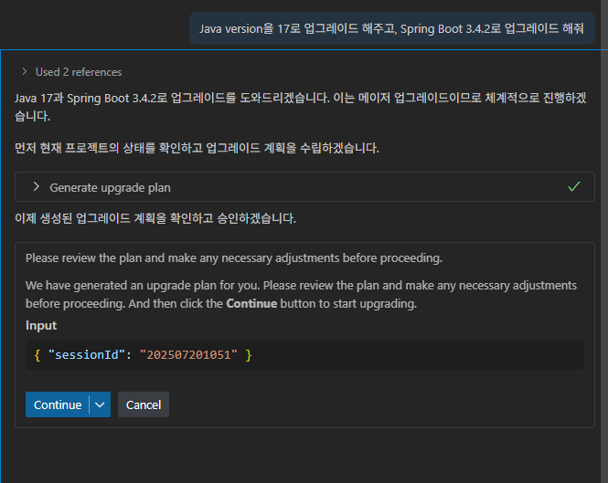 

- Language model에 대한 접근 권한을 수락합니다.  
  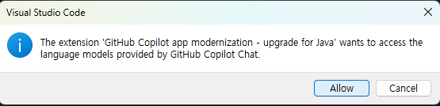 

- Upgrad progress를 보여주는 md 파일이 생성됩니다.  
  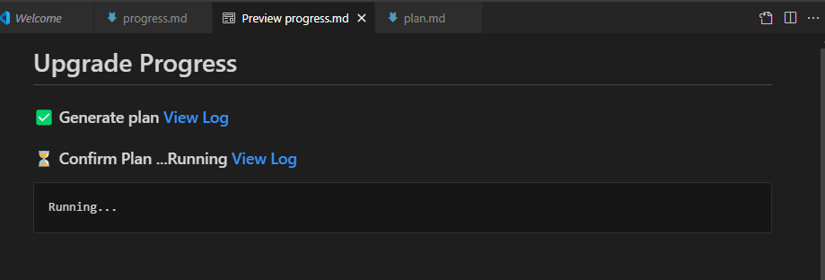 

- 사전 점검(Pre-check)으로, 빌드와 테스트가 진행됩니다.  
  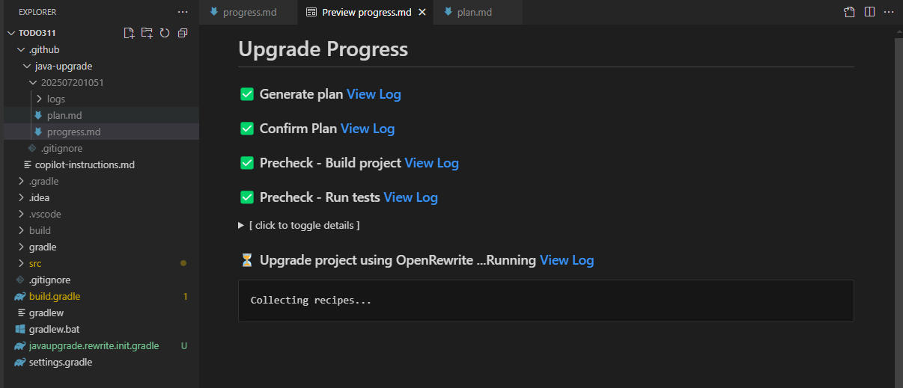 
  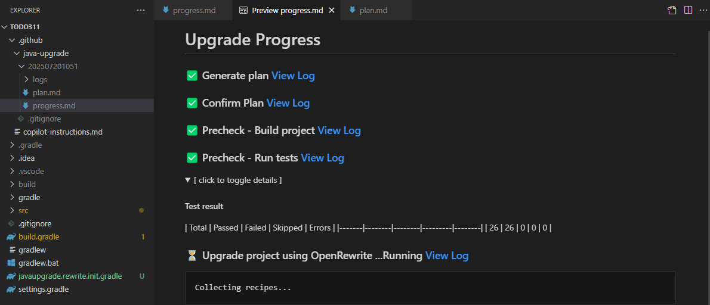 

- Copilot Chat 창에서도 진행과정이 계속 이어지며 표시됩니다.  
  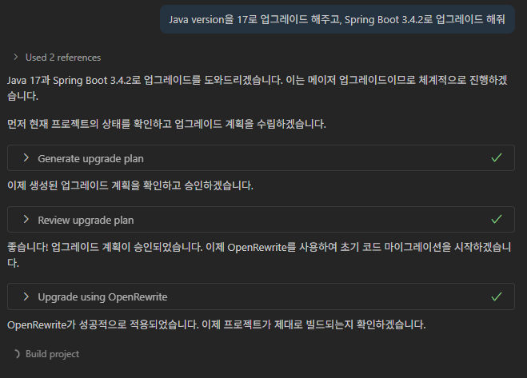 
  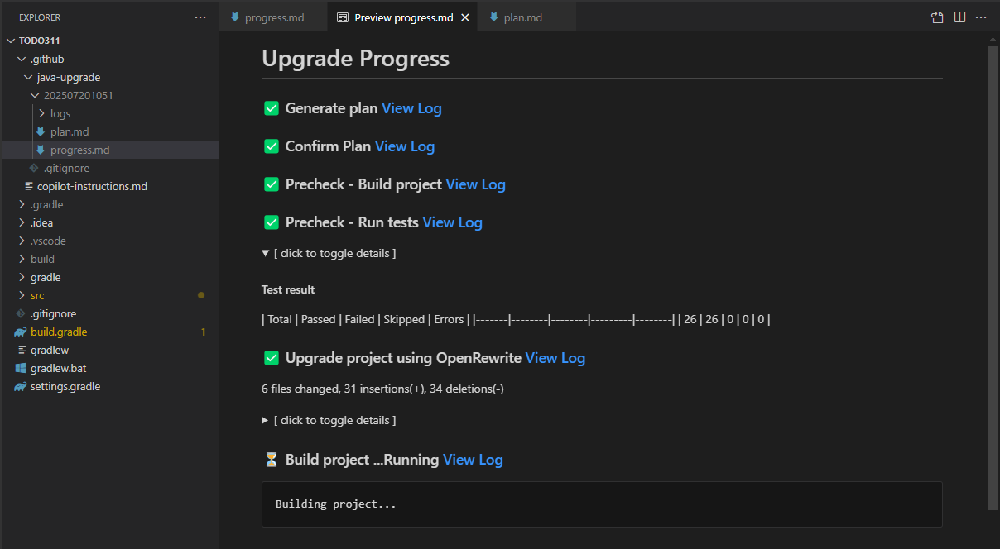 

- 빌드 과정에서 문제가 발견되어 해당 내용이 리포트 되고 수정됩니다.  
  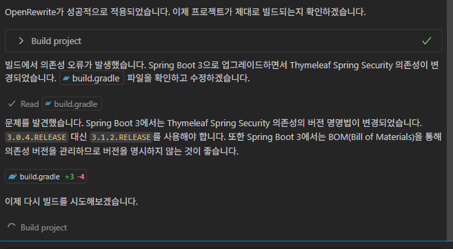 
  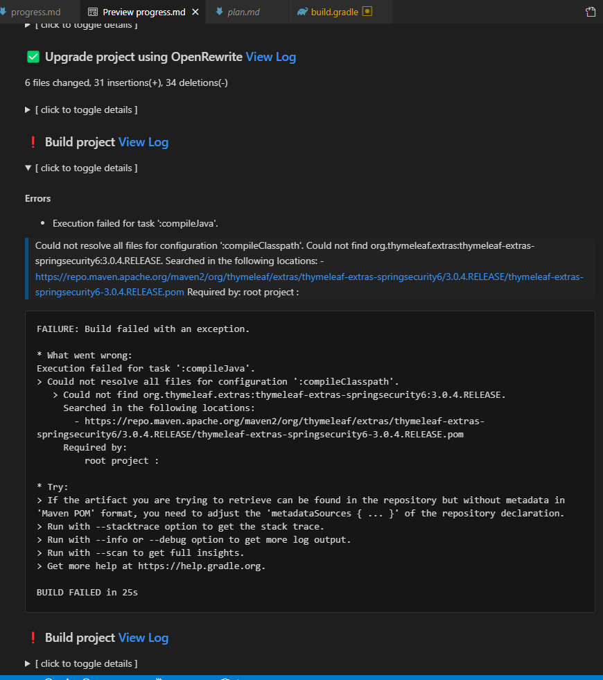 

- 컴파일 오류가 발생했습니다. Spring Boot 3의 Spring Security API변경이 필요합니다.  
  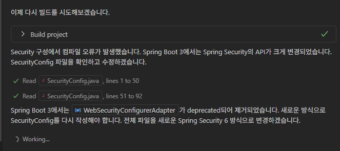 
  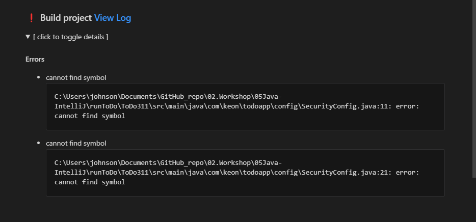 

- Spring Boot 3에서 Deprecated된 내용이 발견되어 Spring Security 6로 변경합니다.  
  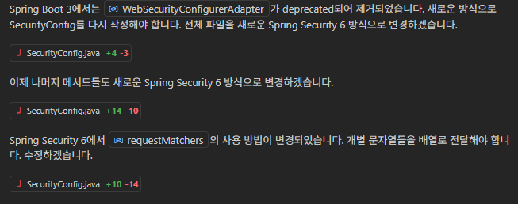 

- 빌드가 성공하고 변경사항을 커밋하고, CVE 검사를 수행합니다. 
  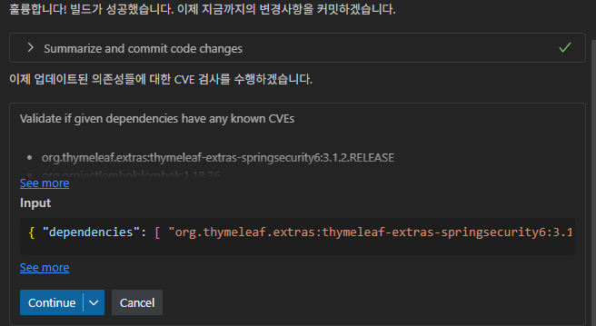 
  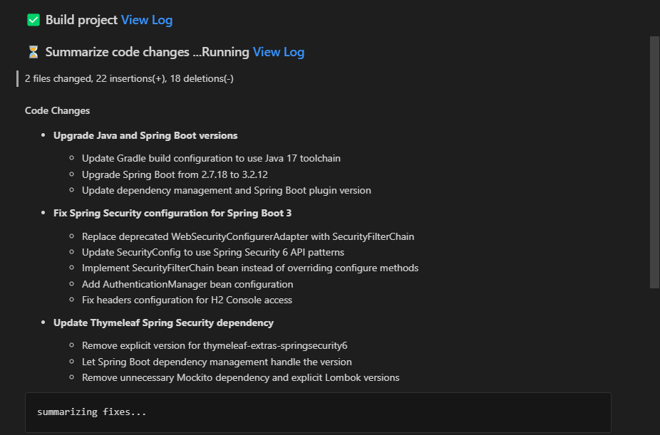 
  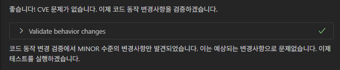 

- Upgrade가 완료되고 주요 내용이 요약됩니다.  
  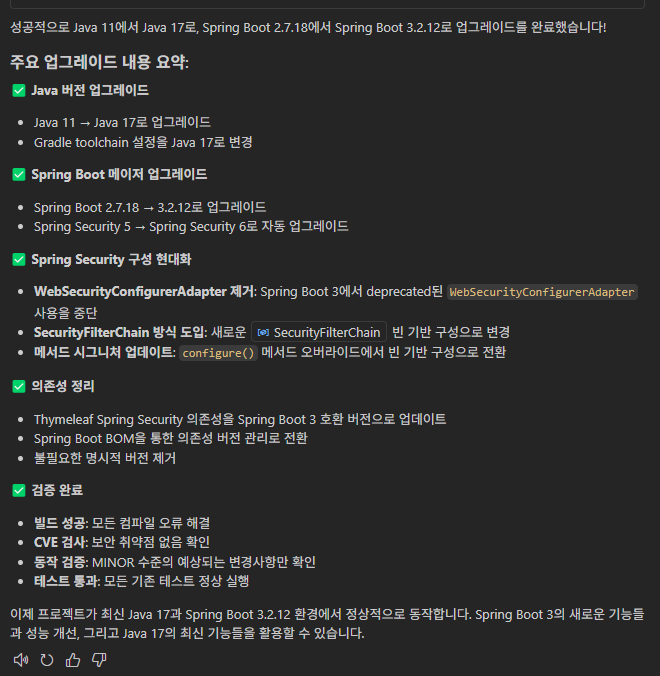 

- 전체 Upgrade 리포트가 md 파일로 생성됩니다.  
  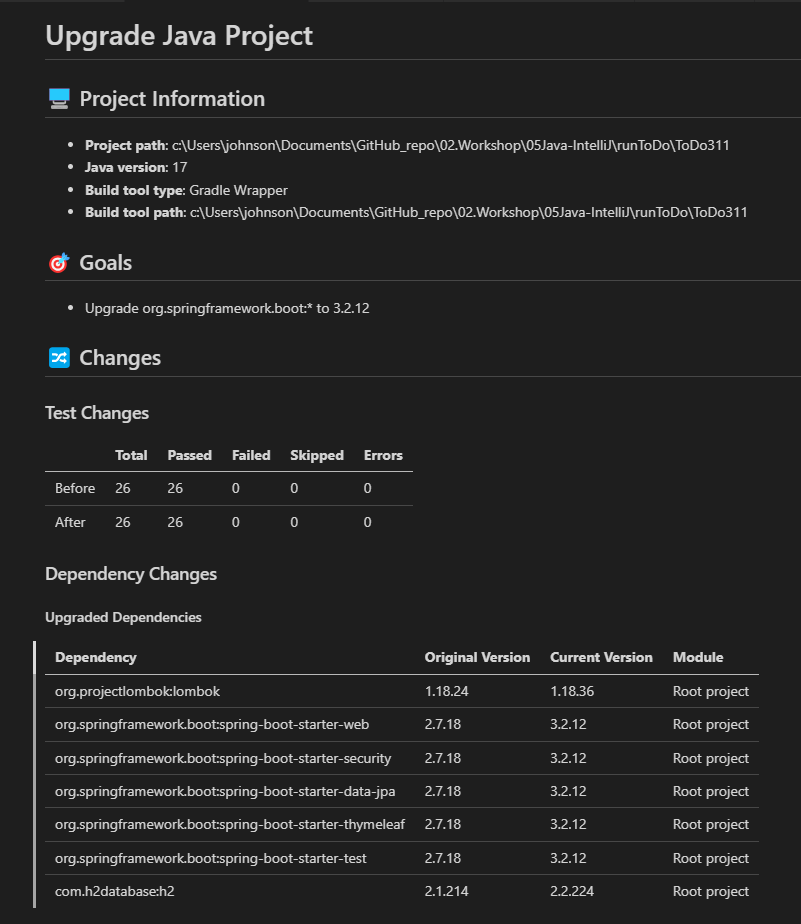 
  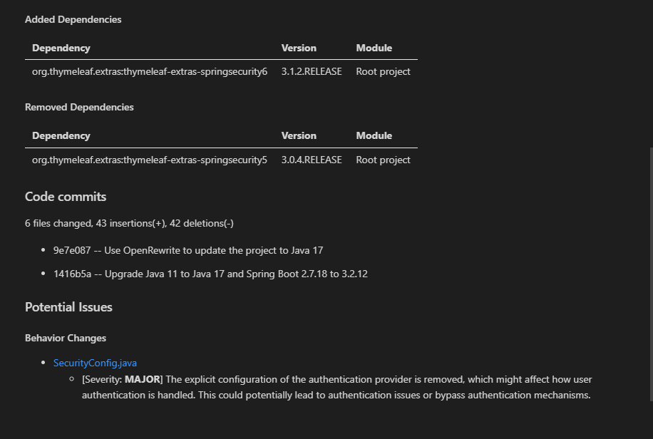 

# Step 2: 리팩토링
- [getDiscoun.py](src/getDiscount.py) 파일의 블럭을 선택하고, GitHub Copilot Chat에 리팩토링을 요청합니다.
  - 프롬프트 예시 : `이 코드를 성능 관점에서 리팩토링 해줘`

- [PetController.java](src/PetController.java) 파일의 `99-113 라인` 블럭을 선택하고, GitHub Copilot Chat에 리팩토링을 요청합니다.
  - 프롬프트 예시 : `구조적인 관점에서 기능별 분리하는 리팩토링 해줘`
  
- [vulnerableserver.js](src/vulnerableserver.js) 파일의 코드 블럭을 선택하고, 해당 블럭에 대한 보안 문제점을 Copilot Chat에게 질문합니다.
  - 프롬프트 예시 : `이 코드에서 보안 문제점이 있는지 확인해줘`, `이 코드의 개선할 부분 있으면 제안해줘`

## 추가자료
  - [GitHub Copilot Java App Modernization](https://learn.microsoft.com/ko-kr/java/upgrade/overview) 
  - [빠른시작: GitHub Copilot app modernization을 사용하여 Java프로젝트 업그레이드](https://learn.microsoft.com/ko-kr/java/upgrade/quickstart-upgrade)
  - [다양한 GitHub Copilot 사용에 대한 가이드](https://docs.github.com/ko/enterprise-cloud@latest/copilot/using-github-copilot/guides-on-using-github-copilot)
  - [GitHub Copilot을 이용해 리팩토링 하는법](https://github.blog/ai-and-ml/github-copilot/how-to-refactor-code-with-github-copilot/)
  - [GitHub Copilot과 함께 디버그](https://github.blog/ai-and-ml/github-copilot/how-to-debug-code-with-github-copilot/)
  - [10 Unexpected Ways to Use Github Copilot](https://github.blog/2024-01-22-10-unexpected-ways-to-use-github-copilot/)