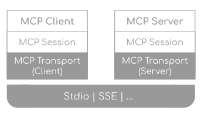
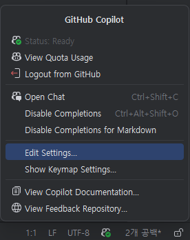

# Task 8: MCP (Model Context Protocol) 활용 실습

## Use case: 
- IntelliJ IDEA에서 Model Context Protocol 서버를 설정하고, 실습하는 예제입니다.

## 목표:
- MCP (Model Context Protocol)의 기능을 이해하고, IntelliJ IDEA에서 MCP 서버를 설정하여 활용하는 방법을 익힙니다.

## Step 1: MCP (Model Context Protocol) 이해하기
### MCP란? 
  - [Model Context Protocol(MCP)](https://modelcontextprotocol.io/introduction)는 AI 모델이 외부 도구, 애플리케이션, 데이터 소스를 탐색하고 상호작용할 수 있도록 표준화된 방법을 제공합니다. IntelliJ IDEA에서 에이전트 모드로 언어 모델에 채팅 프롬프트를 입력하면, 모델은 파일 작업, 데이터베이스 접근, API 호출 등 다양한 도구를 호출하여 요청에 응답할 수 있습니다.
  - [MCP Specification](https://modelcontextprotocol.io/specification/2025-03-26) 

### MCP 구조 : 클라이언트 - 서버 구조
  - MCP clients (like IntelliJ IDEA) connect to MCP servers and request actions on behalf of the AI model
  - MCP servers provide one or more tools that expose specific functionalities through a well-defined interface
  - The Model Context Protocol (MCP) defines the message format for communication between clients and servers, including tool discovery, invocation, and response handling <br>

   <br>
   <br>

### MCP서버의 기능
  - [MCP서버는 아래 3가지 기능을 제공](https://modelcontextprotocol.io/specification/2025-03-26#features)합니다. 
  - Resources: Context and data, for the user or the AI model to use
  - Prompts: Templated messages and workflows for users
  - Tools: Functions for the AI model to execute

### MCP 개발 SDKs
  - [MCP 공식페이지](https://modelcontextprotocol.io/introduction) 에서 다양한 MCP SDK를 확인할 수 있습니다.
  - [python-sdk](https://github.com/modelcontextprotocol/python-sdk)

### MCP 서버의 예시
  - [MCP 서버 예시](https://mcpservers.org/) 
  - [Smithery](https://smithery.ai/)
  - [MCP server repository](https://github.com/modelcontextprotocol/servers) <br>
  - [MCP.so](https://mcp.so/)

  에서 다양한 MCP 서버를 확인할 수 있습니다.


## Step 2: IntelliJ IDEA에서 테스트 MCP 서버 설정 (npm 패키지 설치)

- [IntelliJ IDEA에서 MCP 서버설정: GitHub도움말](https://docs.github.com/en/enterprise-cloud@latest/copilot/how-tos/context/model-context-protocol/extending-copilot-chat-with-mcp?tool=jetbrains)을 참고하여, MCP 서버를 설정합니다. <br>

- 우측 하단의 GitHub Copilot 아이콘을 클릭하고, '`Edit Settings`'를 선택합니다. <br>
   <br>
   <br>

- 'Configure'를 클릭하면, mcp.json 파일이 열립니다. <br>
   <br>
   <br>

## Step 3: MCP 서버 설정하기
- mcp.json 파일의 "servers" 섹션에 아래 부분을 복사하여 붙여 넣어, MCP 서버를 추가합니다.

```json
"memory": {
	"command": "npx",
	"args": [
		"-y",
		"@modelcontextprotocol/server-memory"
	]
}
```

- 위와 같이 설정한 뒤, Copilot Chat 의 도구 모양 아이콘을 클릭하여 추가된 MCP 서버를 확인합니다. <br>
   <br>
   <br>


## Step 4: 로컬에 Stdio MCP 서버 설정
- https://github.com/modelcontextprotocol/python-sdk 의 파이썬 예제를 구성하고 stdio MCP 서버를 설정해 봅니다. 
- uv 매니져 설치
  - https://docs.astral.sh/uv/#installation

- VS Code를 새로 시작하여 새로운 워크 스페이스를 생성합니다. 
- uv 프로젝트 시작
  - `uv init mcp-server-demo`
  - `cd mcp-server-demo` 로 이동
- MCP 서버 설치
  - `uv add "mcp[cli]"`

- server.py 파일을 생성하고 아래와 같이 작성합니다. 
	```python
	# server.py
	from mcp.server.fastmcp import FastMCP

	# Create an MCP server
	mcp = FastMCP("Demo")


	# Add an addition tool
	@mcp.tool()
	def add(a: int, b: int) -> int:
		"""Add two numbers"""
		return a + b

	# Add tool to get the document content
	@mcp.tool()
	def get_document_content() -> str:
		"""Get the content of a document"""
		doc_name = "../doc/06.CopilotStandalone.md"
		with open(doc_name, "r", encoding="utf-8") as f:
			return f.read()

	# Add a dynamic greeting resource
	# @mcp.resource("greeting://{name}")
	# def get_greeting(name: str) -> str:
	#     """Get a personalized greeting"""
	#     return f"Hello, {name}!"

	if __name__ == "__main__":
		mcp.run()
	```

- 위 Step 2에서 MCP 서버를 설정한 것과 같이 생성하되, 이번에는 `Command(stdio)` 형태로 설정합니다. 
  - command는 `uv`로 설정하고, args는 `run server.py`로 설정합니다.
	```json
	
		"mcp-stdio-python": {
			"type": "stdio",
            "command": "uv",
            "args": [
                "run",
                "C:\패스\server.py"
            ]
        }
	```
   <br>

- Agent모드의 MCP Tool에 도구가 추가된 것을 확인합니다. 
   <br>


## Step 6: Atlassian MCP 서버와 연결하기
- Atlassian MCP 서버를 설정하여, Jira와 Confluence와 같은 Atlassian 제품과 통합할 수 있습니다.
- Atlassian에서 제공하는 MCP서버는 Remote MCP 서버로 설정할 수 있습니다.(https://www.atlassian.com/platform/remote-mcp-server)
- 로컬에서 도커로 실행가능한, https://github.com/sooperset/mcp-atlassian 의 MCP서버를 설정할 수 있습니다. 
  - 위 저장소의 README 파일을 참고하여, MCP 서버를 설정합니다.
  - Authentication Setup : B. Personal Access Token (Server/Data Center)
  - Installation : docker 설치

  - 사용가능한 Tool 확인
    - `confluence_search`: Search Confluence content using CQL
	- `confluence_get_page`: Get content of a specific page
	- `confluence_create_page`: Create a new page
	- `confluence_update_page`: Update an existing page

## Step 7: MCP 로그 확인하기
- 좌측 하단에 GitHub Copilot MCP Log' 버튼을 클릭하여 MCP 로그를 확인합니다. <br>
  <br>

## 지식 확인
- MCP의 구조와 기능, 연결 방법은 어떤 것들이 있습니까?
- MCP 서버의 예제들은 어떤 것들이 있습니까?
